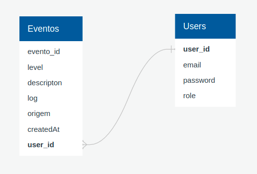

# Projeto Final Codenation - Central de Erros
  - atualizado en 26/10/2021 - 11:19 - Yoneda
# Sumário

- [Integrantes](#integrantes)
- [Rotas da API](#rotas-da-api)   
  - [`/users`](#users)
  - [`/events`](#events)
 - [Database](#database)
 - [Dependências](#dependências)
 - [Andamento](#andamento)
  - [Falta fazer](#falta-fazer)

## Integrantes
  - Adriano Forcellini Pedretti
  - Enio Nical
  - Felipe Santiago
  - Jederson Macedo
  - Johne Alves
  - Layo Kaminski
  - Marcus Witthoeft
  - Tiago Yoneda
  - Uilton Rocha

## Rotas da API

### users
  O endpoint deve ser acessível através do caminho `/users`
  - rota para fazer o cadastro - `POST name, email, password` 
  - rota para fazer o login - `POST email, password` *precisa retornar um token
  - decidir se vamos usar `role` ou não
  
### events 
  O endpoint deve ser acessível através do caminho `/events`
  ** necessário usar token
  - rota para ler todos os evento - `GET` *não mostrar log
  - rota para ler um evento - `GET - event_id` *não mostrar log
  - rota para cadastrar evento - `POST level, description, log, origem ,createdAt, user_id`
  - rota para atualizar evento - `PUT + dados`
  - rota para apagar evento - `DELETE - evento_id`

## Database 

## Dependências
  - Spring Data JPA **falta colocar
  - Spring Security
  - OAuth2 Client
  - Lombok
  - H2Database ou PostgreSQL Driver
  - Spring Web **falta colocar

## Andamento
  - configurada a conexão com o db - postgresql (verificar usando pgadmin)
    - é crida a entidade User no database
  - a aplicação roda e persiste no endereço `localhost:8080`
    - existem algumas rotas

    # Falta fazer
    - criar a entidade eventos
    - criar mais endpoints
    - fazer a verificação via token no login
    - verificar se é possivel consultar o db utilizando o token
